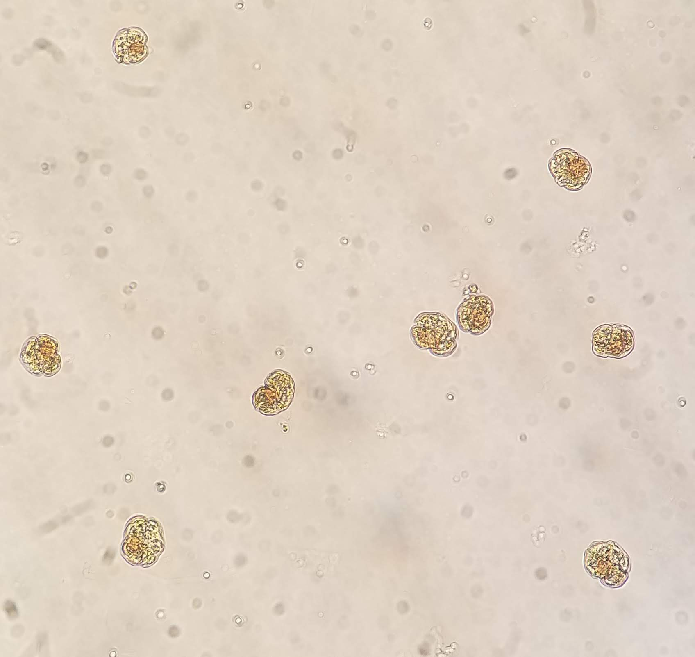
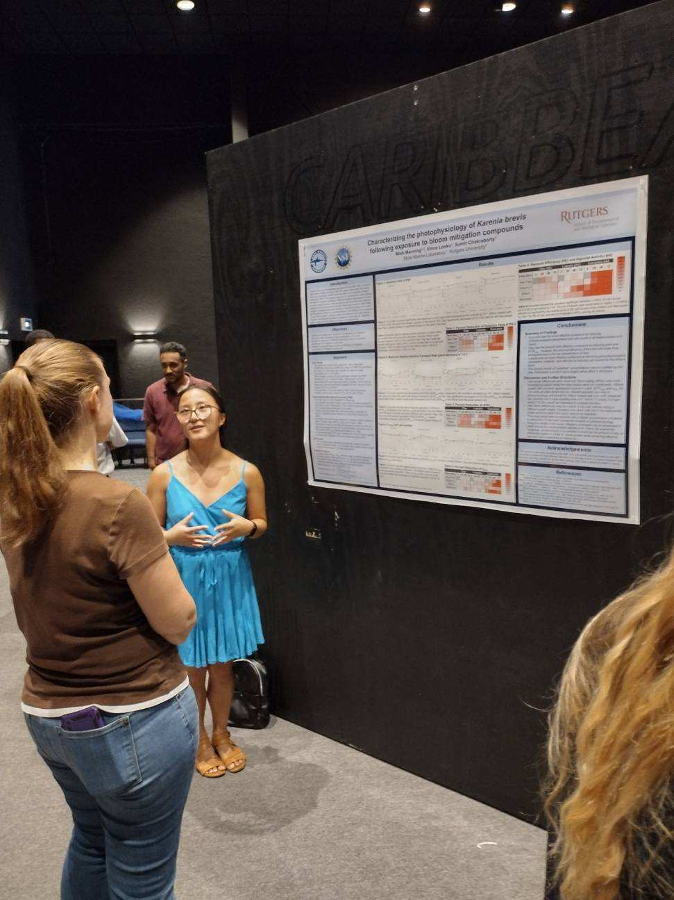

Current Projects
--------------

**Disentangleing the Role of the Phycosphere in the Thermal Range of Toxic *Pseudo-nitzschia spp.***

**Exploring Synergistic Effects of Thermal Stress and Nitrogen Limitation in *Emiliania huxleyi***

Past Projects
--------------

**Effectiveness of Bloom Mitigtation Strategies for *Karenia brevis***

_[Mote Marine Laboratory & Aquarium](https://mote.org/), Advised by [Dr. Vince Lovko](https://mote.org/staff/member/vincent-lovko1)_

_Karenia brevis_ is a harmful algal bloom (HAB)-forming dinoflagellate that causes Florida red
tides, resulting in fish kills, death of sea turtles and marine mammals, neurotoxic shellfish
poisoning (NSP), and respiratory irritation. The negative impacts of _K. brevis_ blooms create
demand for effective mitigation strategies, including physical methods such as clay flocculation
and chemical methods such as the naturally derived flavonoids luteolin and curcumin. Cell death
is the target of most mitigation strategies, however, the exact mechanisms of how these
mitigation compounds affect cellular physiology of _K. brevis_ is still under active research. By
targeting physiological processes such as photosynthesis rather than lethality, it is possible to
disrupt bloom development while conserving resources and minimizing impacts on non-target
organisms and the environment. Experiments were conducted on four strains of _K. brevis_ (New
Pass, Wilson Low Toxin, Wilson, and Manasota) to examine the photophysiological responses
during exposure to “sub-lethal” concentrations of modified clay (0.1 g/L), curcumin (3 mg/L),
and luteolin (3 mg/L). Using Pulse-Amplitude-Modulation (PAM) fluorometry, the quantum
yield of Photosystem II (PSII), relative maximum electron transport rate (rETRmax), and
absorption cross-section of PSII (σPSII) were measured as the photophysiological parameters. The
results demonstrated that curcumin was the most effective compound at reducing
photophysiological parameters and cell counts in all tested strains of K. brevis. Clay was the
second most effective compound at reducing yield and rETRmax. Luteolin exhibited the least
detrimental effect on cell photophysiology. Furthermore, some inter-strain differences were
observed. Notably, the Wilson strain was most impacted by luteolin while the other strains were
not. Additionally, the photophysiological parameters of Wilson treated with curcumin showed
recovery by 24 hours while all other strains did not.

**Phytoplankton Ecology on the West Antarctic Peninsula**
