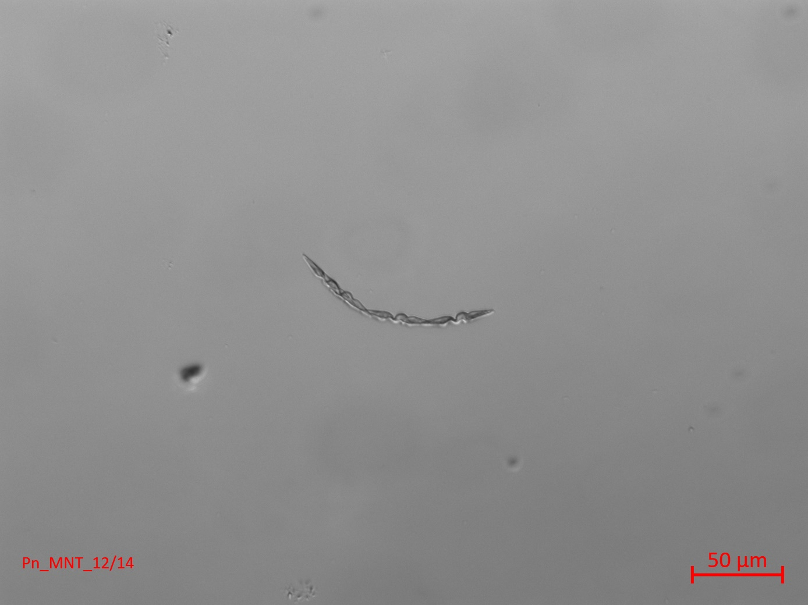
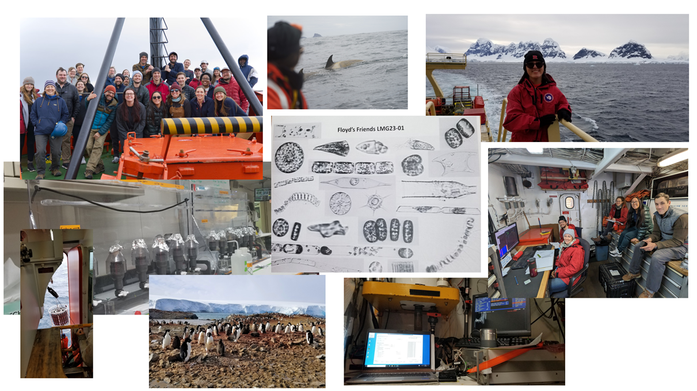

Current Projects
--------------

**Disentangleing the Role of the Phycosphere in the Thermal Range of Toxic *Pseudo-nitzschia spp.***

_[Woods Hole Oceanographic Institution](https://www.whoi.edu/), Advised by [Dr. Harriet Alexander](https://alexanderlabwhoi.github.io)_

One significant challenge arising at the crossroads of public health and ecosystem management is how harmful algal bloom (HAB) species will change in response to global ocean warming. The domoic acid (DA)-producing diatom genus _Pseudo-nitzschia_ is one of the most common HABs along the U.S. West Coast and has a growing presence in the Gulf of Maine (GOM). In the Monterey Bay in 2015 and the GOM in 2016, anomalously warm water masses triggered toxic _Pseudo-nitzschia_ blooms. Understanding the response of _Pseudo-nitzschia_ to a broad range of temperatures is crucial for comprehending HAB dynamics now and in the future. HAB species are often studied in isolation; however, in the natural environment, interactions between heterotrophic marine bacteria and phytoplankton can greatly influence biogeochemical cycling and microbial community structure and function. This interface, termed the phycosphere, is where bacteria and phytoplankton can exchange molecules. This exchange may make microbes more resilient to thermal stress. Though studies have investigated how ocean warming affects _Pseudo-nitzschia_ cell-physiology, there is limited research on how temperature impacts _Pseudo-nitzschia_ and bacteria interactions. The objective of this research is to understand how bacteria-phytoplankton interactions are impacted by thermal stress and how phycosphere composition and exchange of metabolites impacts a host's thermal tolerance and bloom dynamics across coastal and open ocean environments. This study will measure the thermal performance of axenic and xenic strains of _Pseudo-nitzschia spp._ and determine the impact of temperature on bacterial community composition and recruitment. Furthermore, we will isolate individual bacterial members of the _Pseudo-nitzschia spp._ phycosphere and run a series of pairwise bacteria-phytoplankton co-cultures to understand a synthetic bacterial community to elucidate complex host-microbiome interactions.

**Exploring Synergistic Effects of Thermal Stress and Nitrogen Limitation in *Emiliania huxleyi***

_[Woods Hole Oceanographic Institution](https://www.whoi.edu/), Advised by [Dr. Harriet Alexander](https://alexanderlabwhoi.github.io), Contributions by [Arianna Krinos](https://akrinos.github.io)_

_Emiliania huxleyi_ (referred to after as _E. hux_) is a highly abundant and cosmopolitan coccolithophore with a variable pan genome. This genetic diversity may be a driving cause of the success of _E. hux_ in many different environments and niches. While many experiments have looked at the individual effects of nutrient and temperature limitation, looking at the synergistic effects of nutrients and temperature is understudied. This study is looking at two strains (914 and 874) of _E. hux_ at three temperature above the thermal optima in nitrate limited and nitrated replete conditions. The goal is to understand how co-limitation affects the associated bacterial community, the transcriptional repsonse of _E. hux_, the impact on osmolyte production, and intra-species differneces. This data will also be used to inform cell physiology models.

Past Projects
--------------

**Effectiveness of Bloom Mitigtation Strategies for *Karenia brevis***

_[Mote Marine Laboratory & Aquarium](https://mote.org/), Advised by [Dr. Vince Lovko](https://mote.org/staff/member/vincent-lovko1)_

_Karenia brevis_ is a harmful algal bloom (HAB)-forming dinoflagellate that causes Florida red
tides, resulting in fish kills, death of sea turtles and marine mammals, neurotoxic shellfish
poisoning (NSP), and respiratory irritation. The negative impacts of _K. brevis_ blooms create
demand for effective mitigation strategies, including physical methods such as clay flocculation
and chemical methods such as the naturally derived flavonoids luteolin and curcumin. Cell death
is the target of most mitigation strategies, however, the exact mechanisms of how these
mitigation compounds affect cellular physiology of _K. brevis_ is still under active research. By
targeting physiological processes such as photosynthesis rather than lethality, it is possible to
disrupt bloom development while conserving resources and minimizing impacts on non-target
organisms and the environment. Experiments were conducted on four strains of _K. brevis_ (New
Pass, Wilson Low Toxin, Wilson, and Manasota) to examine the photophysiological responses
during exposure to “sub-lethal” concentrations of modified clay (0.1 g/L), curcumin (3 mg/L),
and luteolin (3 mg/L). Using Pulse-Amplitude-Modulation (PAM) fluorometry, the quantum
yield of Photosystem II (PSII), relative maximum electron transport rate (rETRmax), and
absorption cross-section of PSII (σPSII) were measured as the photophysiological parameters. The
results demonstrated that curcumin was the most effective compound at reducing
photophysiological parameters and cell counts in all tested strains of K. brevis. Clay was the
second most effective compound at reducing yield and rETRmax. Luteolin exhibited the least
detrimental effect on cell photophysiology. Furthermore, some inter-strain differences were
observed. Notably, the Wilson strain was most impacted by luteolin while the other strains were
not. Additionally, the photophysiological parameters of Wilson treated with curcumin showed
recovery by 24 hours while all other strains did not.

**Phytoplankton Ecology on the West Antarctic Peninsula**

_[Rutgers University Center for Ocean Observing Leadership](https://rucool.marine.rutgers.edu/), Advised by [Dr. Oscar Schofield](https://marine.rutgers.edu/team/oscar-schofield/)_

The West Antarctic Peninsula (WAP) is a region experiencing rapid warming, with phytoplankton blooms supporting a productive food web. Light availability and environmental factors including mixed layer depth, wind speed, temperature, salinity, and zooplankton abundance influence phytoplankton size, composition, and productivity. This study examines the impact of biotic and abiotic factors on phytoplankton biomass and community composition at grid line 600 at grid station 40, a seafloor canyon off the coast of Anvers island, using data collected by the Palmer Long-Term Ecological Research program. Plant pigments were used to measure total plant biomass and taxa concentrations of diatoms, cryptophytes, and mixed flagellates. Shallower mixed layer depths (<25 meters) were associated with higher phytoplankton concentrations due to greater light availability. Results revealed diatoms as the most abundant, followed by cryptophytes and mixed flagellates respectively. Cryptophyte abundance was highest in the upper 30 meters, with more light and increased stratification. Warmer water temperatures (>0 °C) and lower salinities (~33 PSU) increased cryptophyte abundance, associated with glacial melt conditions and stronger stratification. Zooplankton and phytoplankton were negatively correlated, suggesting zooplankton grazing plays a significant role in phytoplankton abundance. The changing phytoplankton communities may lead to decreased potential primary production on the WAP.
