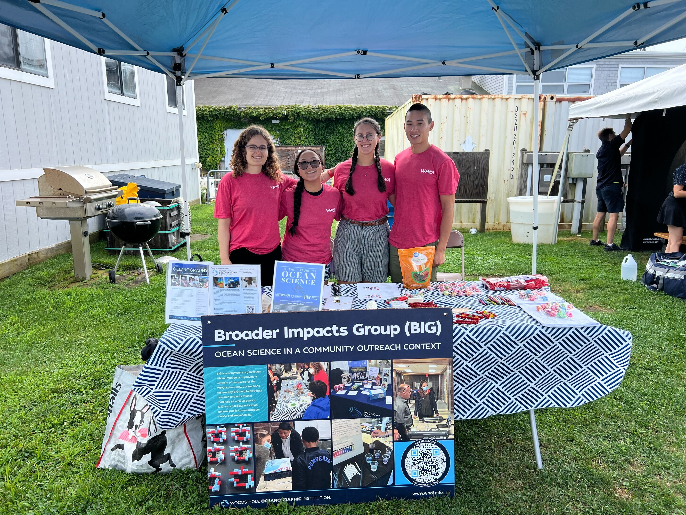
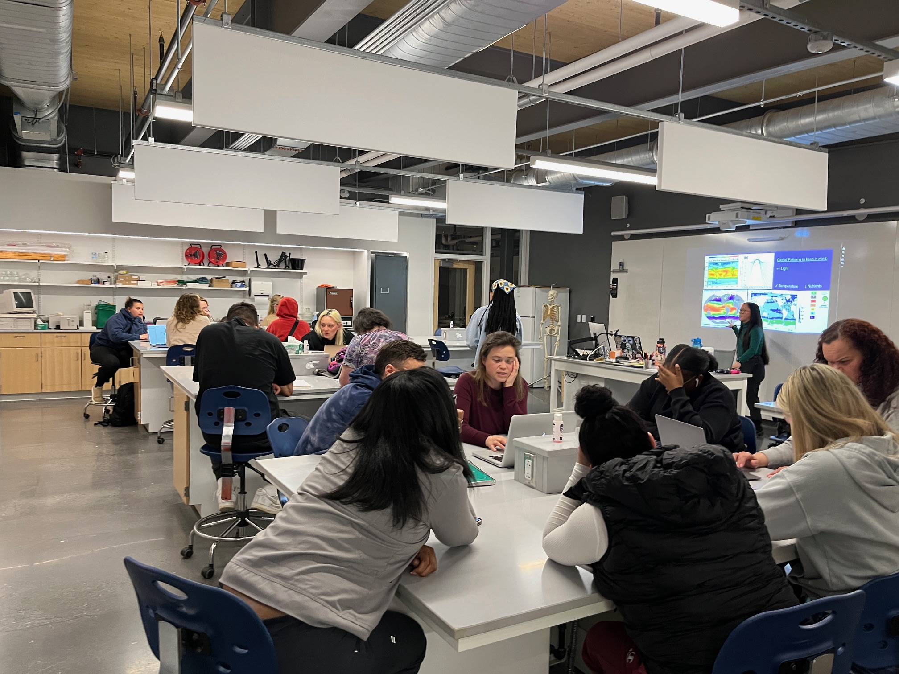
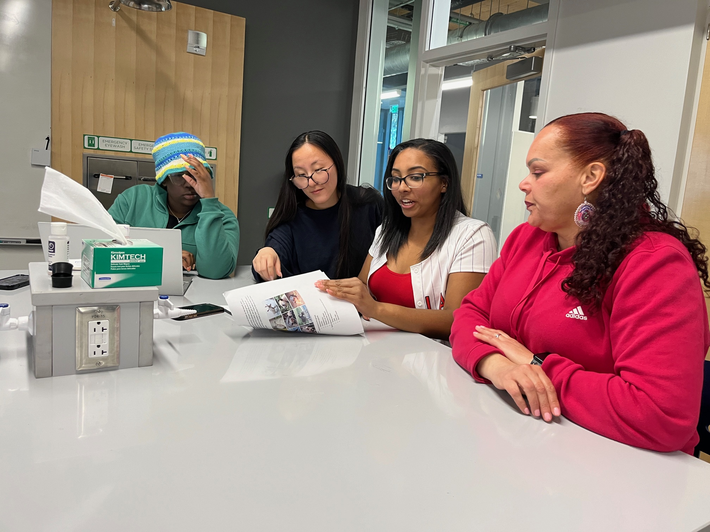
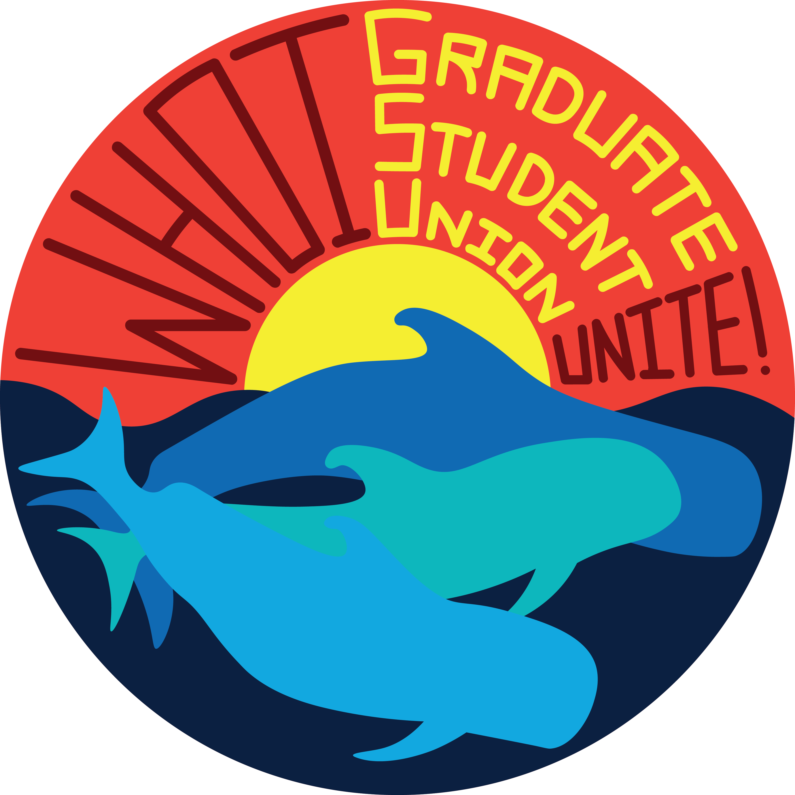

Teaching & Outreach
----------

**Woods Hole Science Stroll**

Each summer, WHOI and the other science institution of Woods Hole participate in the Woods hole Science Stroll. The Science Stroll is a showcase to the public of the science and technology being developed in Woods Hole and beyond. For the 2024 Science Stroll Miah helped the Broader Impacts Group (BIG) at WHOI to promote the educational resources offered at WHOI and the outreach work done by graduate students in the Joint program. This year's BIG booth presented the kind of outreach activities BIG brings to classrooms and fairs to engage elementary school students in STEM. In this year's activity, children could build candy DNA to learm about what is DNA, its structure, and why its important for biology (and also have a tasty treat!).

**Communicating Ocean Science**

In the spring of 2024, Miah took a course offered at WHOI called Communicating Ocean Science, where Joint Program students are schooled in the art of teacing and learning. Each student eaches two lessons, one for a local 4th grade class and one for a undergraduate class at a local community college. The class emphasized the importance of active learning, formative assessment, and creating an inclusive class environment for all level of education. Miah's 4th grade lesson centered on teaching students how salinity and temperature affect the density of water. Miah used colorfully dyed water and called on many volunteers to engage her students. She also paired them off into smaller groups for a more challenning hands-on ice activity to foster collaboration and critical thinking between students.

For Miah's undergraduate class, "Survey of Biology", she taught a lesson on marine microbial diversity. The lecture started off with a warm-up quiz with information they learned previously in the course, as well as some new suprising facts. The lecture set-up information needed to do the group activity. Miah also worked through an example to show the type of thinking students should be considering when approaching their activity. The group activity was a real-world data driven exercise looking at chlorophyll concentrations around the world and at different times of the year. 

**Zephyr Marine**

Beginning in September 2023, Miah began as a volunteer for [Zephyr Marine](https://zephyrmarine.com/), a program aimed at introducing k-12 students to ocean science. The program invites students out for a day boat ride where program director Rob Reynolds and volunteers help the students deploy niskin bottles, sediment traps, underwater carmeras, and investigate benthic invertebrates native to the Cape Cod area. Volunteers lead students on a tour of the Woods Hole Oceanographic Institution docks and Discovery Center. Miah enjoyed sharing her journey into oceanography to the students, answering the students' questions, and teaching the students about her own research and its applications to the local wildlife.

**Letters to a Pre-Scientist (LPS)**

Starting in September 2023, Miah began particiating in the [Letters to a Pre-Scientist](https://prescientist.org/) (LPS) pen-pal program. LPS connects fifth through tenth grade students in low-income communities with STEM professionals through snail mail. Often, the students are paired with professionals that do not fit a stereotypical image of a scientist. Through exchanging letters, the students and scientists describe the higher education pathway and STEM career journey as well as personal obstacles, solutions, and even some fun facts! Miah believes this program is a great way to reach students beyond the Cape Cod area and to engage in thoughtful communication with young people about what careers in STEM look like and lowering the barrier to entry in scientific fields. 

Mentorship & Leadership
----------

**Geoscience Education Mentorship & Support (GEMS)**

As of September 2023, Miah became a mentor for the [Geoscience Education Mentorship & Support](https://gems-program.org/) (GEMS) program. This prorgam matches undergraduate and early-stage graduate students with senior graduate students, postdocs, researchers, staff, or faculty to offer guidance on the graduate school application process, grant and fellowship applications, and the graduate school journey as a whole. Miah has helped two students through this program apply to graduate school and apply for fellowships and she believes that as a mentor, providing ample resources and support, is critical for demystifying the graduate school process and making acadmeia a more inclusive environment.

**Joint Program Applicant Support & Knowledgebase (JP-ASK)**

In September 2023, Miah became a mentor for the [Joint Program Applicant Support & Knowledgebase](https://mit.whoi.edu/admissions/apply/jp-applicant-support-knowledgebase-jp-ask/) (JP-ASK) progam at WHOI. This program pairs current graduate students and prospective students to help prospective students with the application process as well as offer insight to life as a graduate student at WHOI. Miah has mentored two students through this program by helping them find potential advisors ad connecting them with members of the lab of interest, reviewing application material, finding external funding oppurtunities, and chatting about the pros and cons of the MIT-WHOI Joint Program. Since Miah did not know about this program when she applied to WHOI, she wants to particpate and spread the word about this amazing resource for prospective students! As of July 2024, Miah also serves on the student board for JP-ASK, taking on a larger role in organizing the program.

**WHOI Graduate Student Union (GSU) Bargaining Committee (BC)**

On July 19th, 2024, the WHOI GSU was officially recognized and the BC is actively negotiating with WHOI for the first WHOI GSU contract. Miah is an at-large representative and serves on a committee of 8 fellow WHOI graduate students representating all 5 WHOI departments and 3 at-large repreentatives. Miah believes that having a student union at WHOI is critical for codifying the part of the mIT-WHOI Joint Program that students love and having actionable tactics to change what students want to see changed. The WHOI GSU protects the rights and safety Joint Program students, creating an environment where students can speak honestly and feel supported by their peers and by our institution.

Find the WHOI GSU on [Twitter](https://twitter.com/whoigradunion)!
